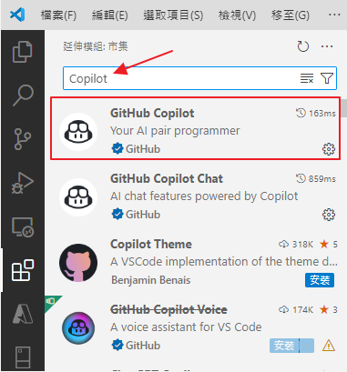
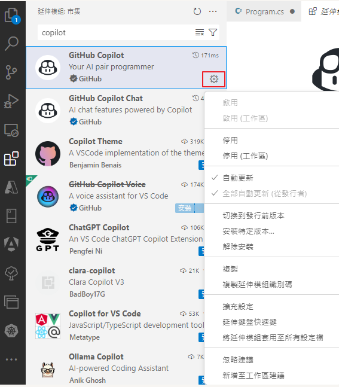

# 114 台科大資管系大一程式設計

---

## 提示步驟

### Copilot 操作

#### 安裝 Copilot Extension 到 VSCode



#### 打開對話

Ctrl + i

#### 打開 Copilot 設定



### Git 操作

當你 Clone 完專案後，請在專案資料夾裡面執行 `delete_git.ps1`，這個批次檔會刪除原本的 Git 資料夾。

接下來請你自己 init 變成你的 git repository

並且提交到你自己的 GitHub Repository 上，記得要公開 Repository (Public)。

```shell
git clone <專案連結> # Clone Repository

./delete_git.ps1 # 執行 delete_git.ps1 來刪除現有的 Git 資料夾
# 若執行失敗請用檔案總管把 `.git` 隱藏的資料夾刪除

git init # 初始化 Git Repository
git config set user.name "你的名字" # 設定 Git 使用者名稱
git config set user.email "你的電子郵件" # 設定 Git 使用者電子郵件
git add . # 添加所有檔案到 Git 暫存區
git commit -m "MESSAGE" # 提交版本
git push remote add origin <你的 GitHub Repository 連結> # 添加遠端 Repository URL
git push -u origin master # 推送到 GitHub
```

---

## 參考連結

### Git

- [下載 Git](https://git-scm.com/downloads)
- [[Git教學] 寫給 Git 初學者的入門 4 步驟](https://www.maxlist.xyz/2018/11/02/git_tutorial/)

### GitHub Copilot

- [參考文章](https://ithelp.ithome.com.tw/articles/10360764)
